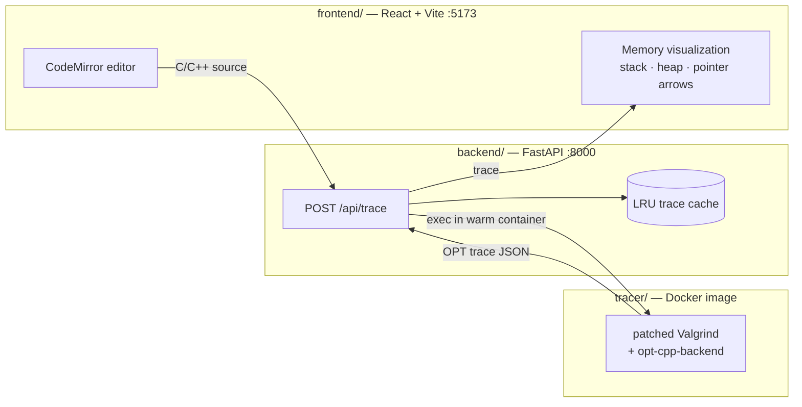
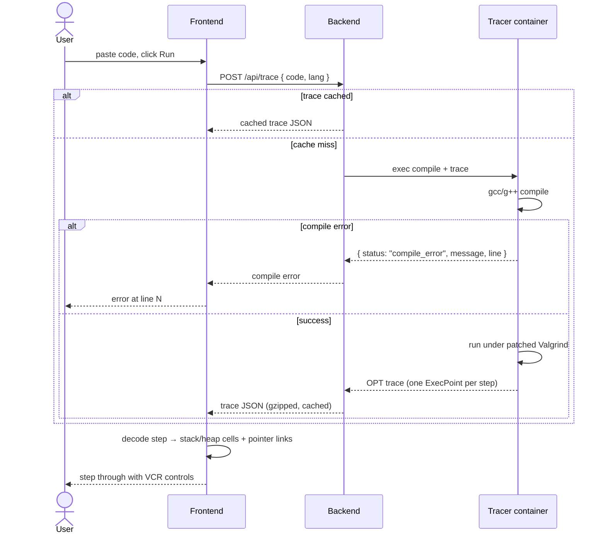

# cpp-tutor

A [Python Tutor](https://pythontutor.com/)-style step-through visualizer for C and C++. Paste code, press run, and step through execution while watching the stack, heap, and pointer relationships update live.

## Quick start

```bash
./install.sh   # builds the tracer Docker image, backend venv, frontend deps
./run.sh       # backend on :8000, frontend on :5173, opens browser
```

Requires Docker, Python 3, and Node.

## Architecture

Three tiers. The tracer does the real work; the backend is a thin wrapper; the frontend decodes and draws.



- **`tracer/`** — Docker image running a patched Valgrind plus the `opt-cpp-backend` submodule. Compiles the user's code and emits a step-by-step execution trace (the OPT trace format: one snapshot of stack frames, heap, and globals per step).
- **`backend/`** — single-endpoint FastAPI service. Executes the tracer in a warm container, caches traces by `(code, lang)`, and returns the trace as JSON (or a compile error).
- **`frontend/`** — React app. A pure data layer (`memoryModel.ts`) decodes each trace step into a normalized memory model; the render layer draws stack/heap cells and an SVG overlay of pointer connectors. VCR-style controls step through the trace.

## Request flow



## Development

| Task | Command |
|---|---|
| Frontend tests | `cd frontend && npm test` |
| Frontend typecheck + build | `cd frontend && npm run build` |
| Backend tests | `cd backend && .venv/bin/pytest` |
| Backend tests, no Docker | `cd backend && .venv/bin/pytest -m "not docker"` |
| Rebuild tracer image | `docker build -t cpp-tutor-tracer:dev tracer/` |

Rebuild the tracer image after touching `tracer/Dockerfile`, `tracer/*.patch`, or the `opt-cpp-backend` submodule — the backend uses the prebuilt image and won't see source changes until you do.

## License

[LICENSE](LICENSE)
