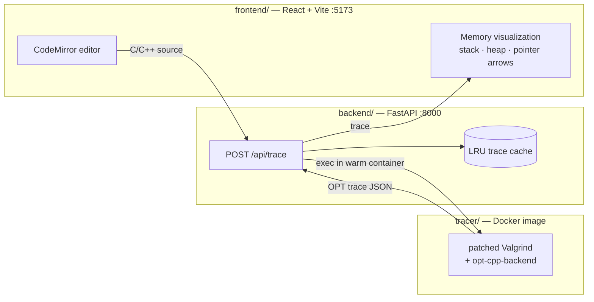
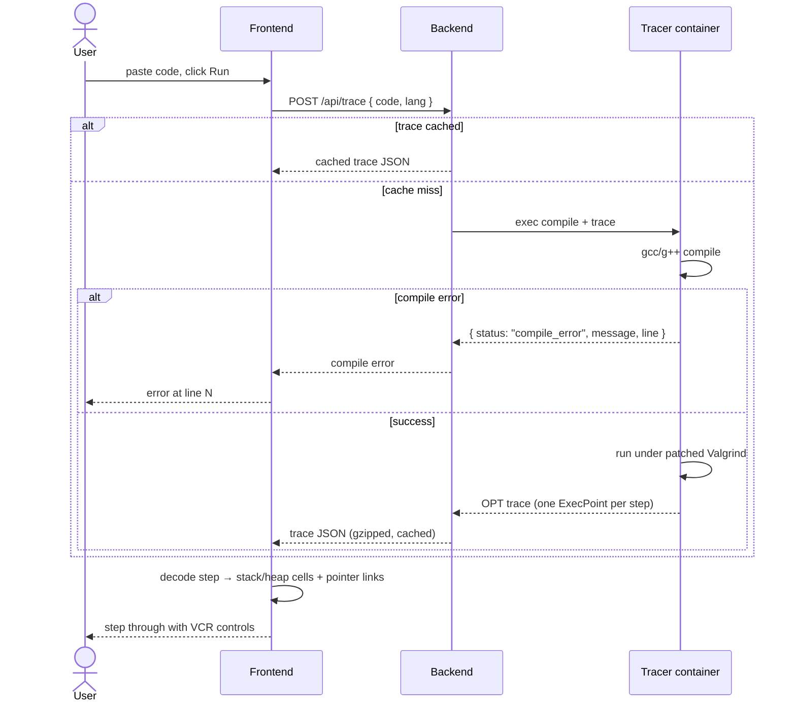

# cpp-tutor

A [Python Tutor](https://pythontutor.com/)-style step-through visualizer for C and C++. Paste code, press run, and step through execution while watching the stack, heap, and pointer relationships update live.

## Features

- **Step-through execution** — VCR-style controls and keyboard shortcuts move through a full trace of the program; the current source line and stack frame are highlighted at every step.
- **Stack, heap, and globals** — every step renders the live frames, heap allocations, and globals as memory cells, with an SVG overlay drawing pointer arrows from each pointer to its target (dashed red when unresolved).
- **STL container decoding** — containers render their logical contents, not raw internals: `vector` (incl. `vector<bool>`), `deque`, `array`, `string`, `pair`, `tuple`, `bitset`; adaptors `stack`/`queue`/`priority_queue`; node containers `list`, `forward_list`, `map`/`set`/`multimap`/`multiset` and the `unordered_` family with real node payloads; plus `unique_ptr`/`shared_ptr`/`weak_ptr` and iterators as pointer cells.
- **Shape-aware heap rendering** — self-referential structs are detected across the whole trace and drawn as the data structure they form: linked lists as rows (with cycle arcs) and trees as slot-aware layouts, with a detail box per node and a raw-view escape hatch.
- **Call tree** — a panel showing the full call history as a tree; clicking a node inspects its arguments and locals as they were at call time.
- **Change highlighting** — cells that changed since the previous step are tinted, down to the individual container element (`v[1]`, `pair.second`, a single string char) rather than the whole container.

## Run with Docker

No setup beyond Docker itself:

```bash
docker run --rm -p 8000:8000 ghcr.io/jmanoj0905/cpp-tutor
```

Then open http://localhost:8000.

The image bundles the tracer (patched Valgrind), the API server, and the
built frontend — arm64 and amd64. Note: traced code runs inside this
container with process-level limits (no network isolation between the app
and traced code, unlike the dev setup's per-request sandbox). Fine for
local single-user use; add your own hardening if exposing it, e.g.:

```bash
docker run --rm -p 8000:8000 --memory 512m --pids-limit 256 --cap-drop all \
  ghcr.io/jmanoj0905/cpp-tutor
```

## Quick start

```bash
./install.sh   # builds the tracer Docker image, backend venv, frontend deps
./run.sh       # backend on :8000, frontend on :5173, opens browser
```

Requires Docker, Python 3, and Node.

## Architecture

Three tiers. The tracer does the real work; the backend is a thin wrapper; the frontend decodes and draws.



- **`tracer/`** — Docker image running a patched Valgrind plus the `opt-cpp-backend` submodule. Compiles the user's code and emits a step-by-step execution trace (the OPT trace format: one snapshot of stack frames, heap, and globals per step).
- **`backend/`** — single-endpoint FastAPI service. Executes the tracer in a warm container, caches traces by `(code, lang)`, and returns the trace as JSON (or a compile error).
- **`frontend/`** — React app. A pure data layer (`memoryModel.ts`, the STL registry in `viz/stl/`, and the shape detector in `viz/shapes.ts`) decodes each trace step into a normalized memory model; the render layer draws stack/heap cells, shape panels for lists/trees, the call tree, and an SVG overlay of pointer connectors. VCR-style controls step through the trace.

## Request flow



## Development

| Task | Command |
|---|---|
| Frontend tests | `cd frontend && npm test` |
| Frontend typecheck + build | `cd frontend && npm run build` |
| Backend tests | `cd backend && .venv/bin/pytest` |
| Backend tests, no Docker | `cd backend && .venv/bin/pytest -m "not docker"` |
| Rebuild tracer image | `docker build -t cpp-tutor-tracer:dev tracer/` |

Rebuild the tracer image after touching `tracer/Dockerfile`, `tracer/*.patch`, or the `opt-cpp-backend` submodule — the backend uses the prebuilt image and won't see source changes until you do.

## License

[LICENSE](LICENSE)
