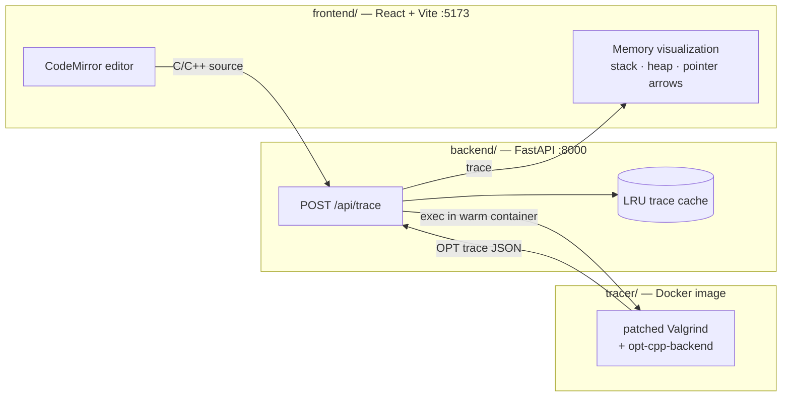
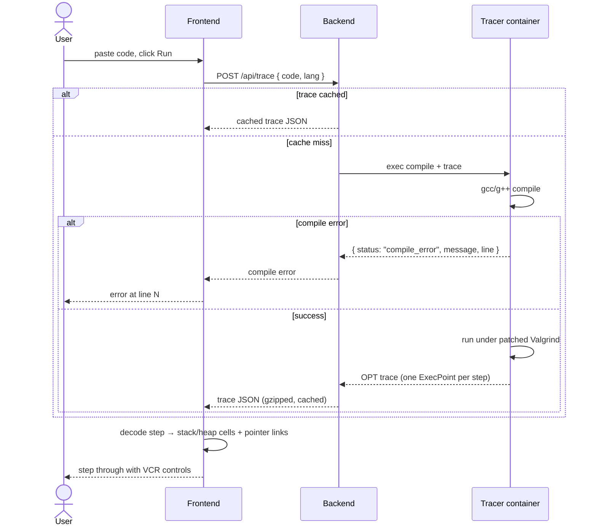

# cpp-tutor

A [Python Tutor](https://pythontutor.com/)-style step-through visualizer for C and C++. Paste code, press run, and step through execution while watching the stack, heap, and pointer relationships update live.

## Try it

- **Hosted:** <https://cpp-tutor.pages.dev> — nothing to install. The backend
  runs on a free Render instance, so the first trace after an idle period waits
  30–60s for the service to wake.
- **Container:** `docker run --rm -p 8000:8000 ghcr.io/jmanoj0905/cpp-tutor`,
  then open <http://localhost:8000>. Bundles tracer + API + frontend, arm64 and
  amd64. Traced code is only process-limited inside it, so harden the run
  before exposing it — see [deploy/image.md](deploy/image.md).
- **VSCode:** the `extension/` package starts that container for you and opens
  the visualizer in the editor — see [extension/README.md](extension/README.md).
- **From source:** the quick start below.

How these four differ — what gets built, where the API lives, how each ships —
is [deploy/README.md](deploy/README.md). Read that before changing a host name,
an env var, or a workflow.

## Quick start

```bash
./install.sh   # builds the tracer Docker image, backend venv, frontend deps
./run.sh       # backend on :8000, frontend on :5173, opens browser
```

Requires Docker, Python 3.11+, and Node. Details, including what to rebuild
after a tracer change: [deploy/local.md](deploy/local.md).

## Architecture

Three tiers. The tracer does the real work; the backend is a thin wrapper; the frontend decodes and draws.


```mermaid
flowchart LR
    subgraph frontend ["frontend/ — React + Vite :5173"]
        Editor[CodeMirror editor]
        Viz[Memory visualization<br/>stack · heap · pointer arrows]
    end

    subgraph backend ["backend/ — FastAPI :8000"]
        API["POST /api/trace"]
        Cache[(LRU trace cache)]
    end

    subgraph tracer ["tracer/ — Docker image"]
        Valgrind[patched Valgrind<br/>+ opt-cpp-backend]
    end

    Editor -->|C/C++ source| API
    API --> Cache
    API -->|exec in warm container| Valgrind
    Valgrind -->|OPT trace JSON| API
    API -->|trace| Viz
```

- **`tracer/`** — Docker image running a patched Valgrind plus the `opt-cpp-backend` submodule. Compiles the user's code and emits a step-by-step execution trace (the OPT trace format: one snapshot of stack frames, heap, and globals per step).
- **`backend/`** — single-endpoint FastAPI service. Executes the tracer in a warm container, caches traces by `(code, lang)`, and returns the trace as JSON (or a compile error).
- **`frontend/`** — React app. A pure data layer (`memoryModel.ts`, the STL registry in `viz/stl/`, and the shape detector in `viz/shapes.ts`) decodes each trace step into a normalized memory model; the render layer draws stack/heap cells, shape panels for lists/trees, the call tree, and an SVG overlay of pointer connectors. VCR-style controls step through the trace.

## Request flow


```mermaid
sequenceDiagram
    actor User
    participant FE as Frontend
    participant BE as Backend
    participant TR as Tracer container

    User->>FE: paste code, click Run
    FE->>BE: POST /api/trace { code, lang }
    alt trace cached
        BE-->>FE: cached trace JSON
    else cache miss
        BE->>TR: exec compile + trace
        TR->>TR: gcc/g++ compile
        alt compile error
            TR-->>BE: { status: "compile_error", message, line }
            BE-->>FE: compile error
            FE-->>User: error at line N
        else success
            TR->>TR: run under patched Valgrind
            TR-->>BE: OPT trace (one ExecPoint per step)
            BE-->>FE: trace JSON (gzipped, cached)
        end
    end
    FE->>FE: decode step → stack/heap cells + pointer links
    FE-->>User: step through with VCR controls
```

## Development

| Task | Command |
|---|---|
| Frontend tests | `cd frontend && npm test` |
| Frontend typecheck + build | `cd frontend && npm run build` |
| Backend tests | `cd backend && .venv/bin/pytest` |
| Backend tests, no Docker | `cd backend && .venv/bin/pytest -m "not docker"` |
| Rebuild tracer image | `docker build -t cpp-tutor-tracer:dev tracer/` |

Rebuild the tracer image after touching `tracer/Dockerfile`, `tracer/*.patch`, or the `opt-cpp-backend` submodule — the backend uses the prebuilt image and won't see source changes until you do, and the warm container (`docker rm -f cpp-tutor-tracer-warm`) keeps serving the old one until removed.

## Deployment

| Mode | Doc |
|---|---|
| Local dev (`./run.sh`) | [deploy/local.md](deploy/local.md) |
| Container image | [deploy/image.md](deploy/image.md) |
| Hosted site (Pages + Render) | [deploy/hosted.md](deploy/hosted.md) |
| VSCode extension | [deploy/extension.md](deploy/extension.md) |

## License

[LICENSE](LICENSE)
